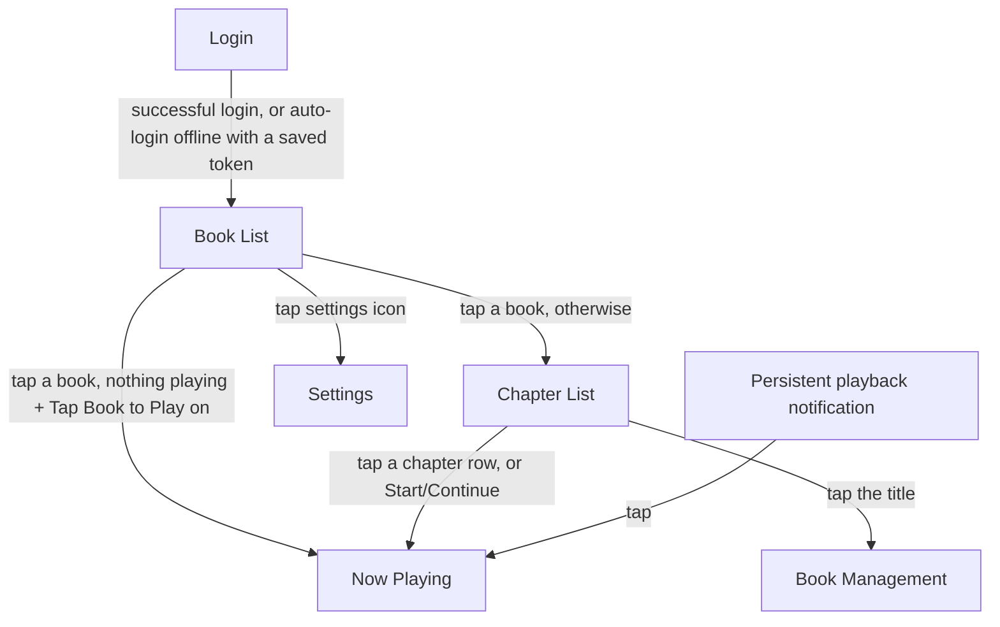

# Screen guide

A walkthrough of ShelfTime's screens and how to interact with each one.
Screenshots referenced here are auto-generated -- see the "Screenshot-based
documentation sprint" section of `CLAUDE.md` for how, and
`docs/screenshots/` for the current images once that workflow has run.

## Navigation map

Every screen besides Book List is reached by going *forward* from Book List
(directly or via Chapter List) -- there's no separate menu or tab bar.
System Back (or, on Now Playing, a single press of the physical Back
button) always returns to whichever screen launched the current one.
Book Management, Settings, and Now Playing are dead ends navigation-wise:
none of them launches another screen, only Back leaves them. The one
shortcut back to Now Playing from outside the app is the persistent
playback notification -- tapping a book in the main list while something
is *already* playing deliberately does **not** jump back to Now Playing
(it opens Chapter List instead, per the Tap Book to Play behavior above),
so the notification is the fastest way back to a playback session already
in progress.

## Book List

The home screen. "Continue Listening" -- books with real playback progress
that aren't finished, most-recently-listened first -- is shown ahead of the
rest of the library.

- **Tap search**: opens voice/keyboard search to filter the list.
- **Tap settings**: opens the Settings screen.
- **Tap a book**: jumps straight into playback if nothing's currently
  playing and the "Tap Book to Play" setting is on (Settings); otherwise
  opens the Chapter List for that book.
- **Swipe a row**: reveals the primary action for that book --
  - Not downloaded: green **Download**.
  - Actively downloading: amber **Cancel**, with a live green fill bar
    (grows with progress) plus downloaded/total bytes and speed.
  - Fully downloaded: red **Delete**, with a 5-second **Undo** chip to
    re-queue the download.
  - A full swipe triggers the primary action immediately instead of just
    revealing it.
- **Rotary bezel/crown**: scrolls the list.

## Chapter List

- **Title** (top): tap to open Book Management for this book. Shows a small
  checkmark if the book is fully downloaded.
- Below the title: a live amber/green download progress bar with
  percent/speed/time-remaining, shown only while downloading.
- **Start/Continue button**: hidden entirely if this book is the one
  currently playing -- the chapter rows below are already the way to
  interact with it.
- **Tap a chapter row**: starts playback at that chapter's position.
- **Rotary bezel/crown**: scrolls the chapter list.

## Book Management

Reached by tapping the title on the Chapter List screen. Shows Size,
Chapter count, Author, Narrator (if present), and current device Free
Space.

- **Download/Cancel/Delete button**: same three-way behavior and colors as
  the Book List swipe row (green/amber-with-progress/red), but no Undo --
  visiting this screen and tapping is itself the deliberate action.
- New downloads are blocked (with a toast) if they'd exceed device free
  space or your configured Smart Delete storage limit -- same policy as
  the Book List.

## Now Playing

- **Time display** (top): tap to cycle chapter-remaining (default) →
  chapter-elapsed/total → book-elapsed/total.
- **Play/Pause**: center button.
- **Rewind/Fast-forward**: either side, labeled with your configured
  jump-seconds (Settings).
- **Speed and volume**: sliders further down.
- **Sleep timer**: cycles Off / fixed minute options / "sleep at end of
  chapter" -- recomputed on real playback events (seek, speed change,
  pause/resume), not a polling loop.
- **Physical Back button**: single press navigates back (with a ~350ms
  delay to check for a second press); double press within that window
  toggles Play/Pause instead. The watch's Home button can't be
  intercepted at all -- its press behavior is reserved by Wear OS itself.
- **Rotary bezel/crown**: configurable in Settings -- Scrub (seek），
  Volume, or Off.

## Settings

- **Jump Backward/Forward**: +/- steppers, 5-60 seconds in steps of 5.
- **Bezel Input**: tap to cycle Scrub / Volume / Off.
- **Tap Book to Play**: toggle controlling the Book List tap-to-play
  behavior described above (on by default).
- **Smart Delete**: toggle; when on, reveals **Maximum Downloads** and
  **Maximum Storage (GB)** steppers. Old downloads are deleted
  automatically once a limit is reached, and starting a *new* download
  that would exceed either limit is blocked (manual deletion required)
  rather than auto-evicted.
